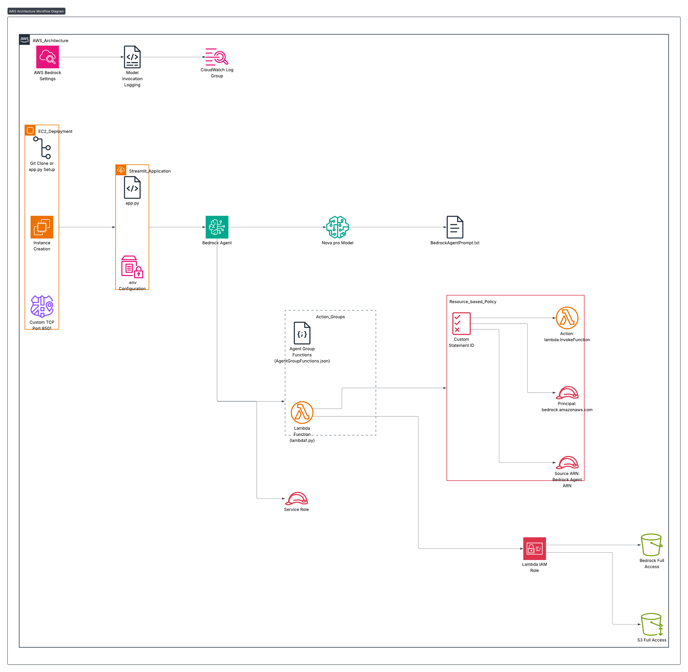

# Supply Chain Crisis Manager 📦

An AI-powered supply chain risk management and crisis response system built using AWS Bedrock Agent, leveraging the power of LLMs for real-time decision making and crisis management.

## Project Overview

Supply Chain Crisis Manager helps organizations:
- Analyze supplier risks across different regions
- Identify alternative suppliers in crisis scenarios
- Assess crisis impact on supply chain operations
- Generate smart procurement recommendations
- Provide real-time crisis management solutions

## Architecture

### Data Flow Steps

**User Interaction:**  
User types query in Streamlit frontend. The app reads `.env` for credentials & Bedrock Agent ID.

**Query Sent to Bedrock Agent:**  
API call to Bedrock using `BEDROCK_AGENT_ALIAS_ID`. The agent uses Nova Pro Model with instructions in `BedrockAgentPrompt.txt`.

**Agent Decision Making:**  
Agent determines whether to invoke any Action Group Lambda based on the query (e.g., `calculate_crisis_impact()`, `find_alternative_suppliers()`).

**Lambda Invocation:**  
Bedrock Agent invokes Lambda using `lambda:InvokeFunction`. Lambda fetches data from S3, processes it, and returns structured results.

**Result Aggregation:**  
Bedrock Agent combines outputs from Nova Pro model and Lambda functions and returns the final response to the Streamlit frontend.

**Logging:**  
Bedrock invocation logs → CloudWatch  
Lambda execution logs → CloudWatch

### Architecture Diagram



## Features

1. **Supplier Risk Analysis**
   - Regional risk assessment
   - Supplier reliability metrics
   - Combined risk scoring

2. **Alternative Supplier Discovery**
   - Multi-region supplier alternatives
   - Supplier capability matching
   - Risk-based recommendations

3. **Crisis Impact Assessment**
   - Real-time impact calculation
   - Multi-metric analysis
   - Severity classification

4. **Smart Procurement Recommendations**
   - Crisis-specific strategies
   - Alternative sourcing plans
   - Risk mitigation suggestions

## Technology Stack

- **AWS Bedrock** with Nova Pro LLM
- **AWS Lambda** for serverless functions
- **AWS IAM** for access management
- **Streamlit** for frontend
- **Python** for backend development
- **CloudWatch** for logging

## Setup Instructions

1. **Environment Setup**
```bash
# Clone the repository
git clone https://github.com/maheshwari2000/supply-chain-crisis-manager.git
cd supply-chain-crisis-manager

# Install requirements
pip install -r requirements.txt
```

2. **Configure Environment Variables**  
Create a `.env` file with:
```
AWS_ACCESS_KEY_ID=your_access_key
AWS_SECRET_ACCESS_KEY=your_secret_key
AWS_REGION=us-east-1
BEDROCK_AGENT_ID=your_agent_id
BEDROCK_AGENT_ALIAS_ID=your_agent_alias_id
DEBUG=True
```

3. **Run the Application**
```bash
streamlit run app.py
```

## Example Queries

1. "Analyze supplier risk for NVIDIA in Taiwan"  
2. "Find alternative semiconductor suppliers for TSMC"  
3. "If an earthquake hits Taiwan, what's the crisis impact?"  
4. "Generate procurement recommendations if Foxconn is affected by a strike."

## Deployment

### EC2 Deployment Steps:
1. Launch EC2 instance  
2. Configure security group to allow custom TCP on port 8501  
3. Clone repository or create required files  
4. Set up environment variables  
5. Run the Streamlit application

## Security

- AWS IAM roles and policies for secure access  
- Resource-based policies for Lambda functions  
- Secure environment variable management  
- CloudWatch logging for monitoring and debugging

## License

This project is licensed under the MIT License - see the LICENSE file for details.
